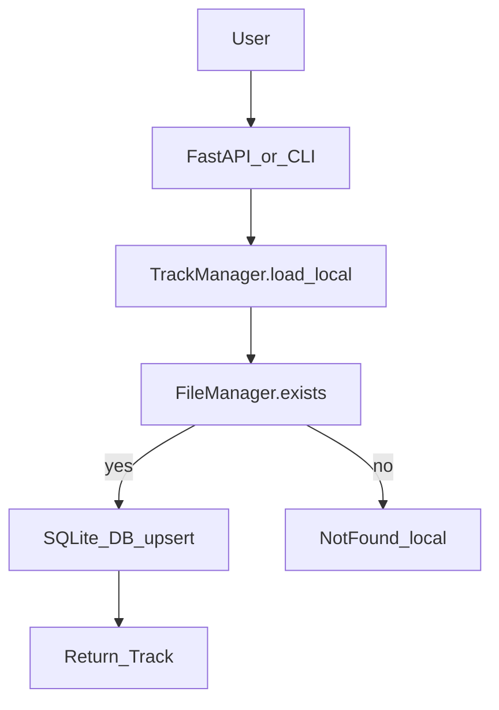

## Current baseline

- API already exists in [src/synciflow/api/server.py](src/synciflow/api/server.py) with `/track/load`, `/playlist/load`, `/playlist/sync`, `GET /track/{id}`, `GET /playlist/{id}`, and `GET /track/{id}/stream`.
- CLI already exists in [src/synciflow/cli/main.py](src/synciflow/cli/main.py) using Typer with `track`, `playlist`, `sync`, `serve`.
- Track download is already “local-first” *once the DB row exists*; it checks `FileManager.exists(track_id)` and repairs `audio_path` if needed in [src/synciflow/core/track_manager.py](src/synciflow/core/track_manager.py).

## Goal changes

- Add **local-first load by ID** that can **repair/create DB rows when files exist locally**.
- Add API + CLI support to **download a track file** and **download a playlist as a ZIP**.
- Add a **Rich interactive CLI** (“smart mode”) that presents a menu and offers CRUD-ish operations for tracks/playlists.

## Design decisions (keeps existing behavior)

- Keep existing URL-based `load_track(url)` / `load_playlist(url)` untouched.
- Add new methods:
  - `TrackManager.load_local(track_id: str) -> Track`
  - `PlaylistManager.load_local(playlist_id: str) -> Playlist`
- Persist playlist metadata on online load so local playlist load has an ordering source:
  - Write playlist metadata JSON to `storage_data/playlists/{playlist_id}.json` (path already defined by `playlist_metadata_path`).
  - Local playlist load uses that JSON (if present) to rebuild `PlaylistTrack` relations and to call `TrackManager.load_local()` for each track.

## API surface (FastAPI)

Extend [src/synciflow/api/server.py](src/synciflow/api/server.py):

- **Local-first load**
  - `POST /track/{track_id}/load_local` → returns `Track`
  - `POST /playlist/{playlist_id}/load_local` → returns `Playlist`
- **Download endpoints**
  - `GET /track/{track_id}/download` → `FileResponse` (attachment)
  - `GET /playlist/{playlist_id}/download.zip` → streamed ZIP of all available track files in playlist order
- **View/list endpoints (for the interactive CLI + users)**
  - `GET /tracks` → list tracks (optionally with `?q=`)
  - `GET /playlists` → list playlists
  - `GET /playlist/{playlist_id}/tracks` → list track entries in order (join `PlaylistTrack`)

## Core implementation details

Update [src/synciflow/core/track_manager.py](src/synciflow/core/track_manager.py):

- Implement `load_local(track_id)`:
  - If local mp3 exists (`files.exists(track_id)`):
    - Ensure DB `Track` row exists; if missing, create minimal row with `track_id`, `audio_path`, `downloaded_at`.
    - If row exists, repair `audio_path` and set `downloaded_at` when missing.
    - Return the row.
  - If local mp3 missing: raise a clear error (used by API/CLI to show “not found locally”).

Update [src/synciflow/core/playlist_manager.py](src/synciflow/core/playlist_manager.py):

- On `load_playlist(url)`, after fetching details, **persist metadata JSON** to `storage.playlists_dir` (new helper in storage layer).
- Implement `load_local(playlist_id)`:
  - Ensure playlist DB row exists (create minimal if needed).
  - If metadata JSON exists:
    - Rebuild `PlaylistTrack` relations based on stored order.
    - For each entry, call `tracks.load_local(track_id)` (or derive track_id from stored URLs and then local-load).
  - If metadata JSON missing: return playlist row but no relations (and report empty list via API/CLI).

Add a small storage helper module (new):

- `src/synciflow/storage/playlist_metadata.py` to read/write playlist metadata JSON (playlist_id, title, track_urls or track_ids).

Add ZIP builder helper (new):

- `src/synciflow/storage/zip_builder.py`:
  - Given playlist_id and ordered track_ids, yield a streaming ZIP (or create a temp zip file) including each existing mp3.
  - Decide filename conventions (e.g. `{position:03d}-{track_id}.mp3`).

## CLI changes (non-interactive commands)

Update [src/synciflow/cli/main.py](src/synciflow/cli/main.py) to add commands while keeping old ones:

- `track-local TRACK_ID` → calls `TrackManager.load_local`
- `playlist-local PLAYLIST_ID` → calls `PlaylistManager.load_local`
- `download-track TRACK_ID --out PATH?` → saves/copies mp3 to destination (or prints existing path)
- `download-playlist-zip PLAYLIST_ID --out PATH` → calls API-like ZIP builder locally
- `tracks` / `playlists` list commands for quick terminal usage

## Smart interactive CLI (Rich)

Add new file [src/synciflow/cli/smart.py](src/synciflow/cli/smart.py):

- Uses `rich` for:
  - Menu selection (Prompt), tables (Table), panels (Panel), status spinners.
  - Styled output (bold/colors) to satisfy “colors and fonts”.
- Features (menu-driven):
  - **Load track (URL)**, **Load track (local ID)**
  - **List tracks** → select a track → view details → actions: download/open path, delete audio, delete DB row
  - **List playlists** → select playlist → view tracks → actions: ZIP download, local-load/repair, remove playlist from DB
- Activation via args in [src/synciflow/cli/main.py](src/synciflow/cli/main.py):
  - Add Typer command `smart` so user runs `synciflow smart`.
  - Optionally add `--smart` flag at root command callback to immediately launch interactive mode.

## Dependencies

- Add `rich` to `pyproject.toml` dependencies.

## Verification

- Quick manual checks:
  - If a track mp3 exists but DB row deleted, `track-local` recreates row and API `/track/{id}` works.
  - Playlist ZIP endpoint returns a valid zip containing existing mp3s.
  - Existing commands (`track`, `playlist`, `sync`, `serve`) continue to behave identically.

## Mermaid data flow (local-first)

