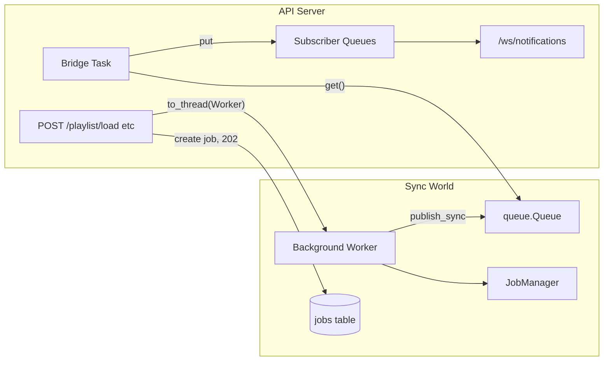

# Job Tracking and Notification System

## Current state

- **DB**: SQLModel in [src/synciflow/db/models.py](src/synciflow/db/models.py); [src/synciflow/db/database.py](src/synciflow/db/database.py) uses `init_db()` to create all tables (no migrations).
- **Long-running work**: All synchronous in [playlist_manager.py](src/synciflow/core/playlist_manager.py) (`load_playlist`), [track_manager.py](src/synciflow/core/track_manager.py) (`load_track`), [sync_manager.py](src/synciflow/core/sync_manager.py) (`sync_playlist`). No asyncio or threading.
- **API**: FastAPI in [src/synciflow/api/server.py](src/synciflow/api/server.py); endpoints block until completion. No WebSockets.
- **CLI**: Typer in [src/synciflow/cli/main.py](src/synciflow/cli/main.py); Rich used in [smart.py](src/synciflow/cli/smart.py) for tables/panels only, no progress bars.
- **Dependencies**: [pyproject.toml](pyproject.toml) already has `rich>=13.0.0`; no `websockets` needed (FastAPI/Starlette provide WebSocket support).

---

## 1. Job table and model

- **File**: [src/synciflow/db/models.py](src/synciflow/db/models.py)
- Add a `Job` SQLModel table with:
  - `job_id` (str, PK, e.g. UUID)
  - `job_type` (str: `"track_load"`, `"playlist_load"`, `"sync"`, etc.)
  - `status` (str: `"pending"`, `"running"`, `"completed"`, `"failed"`)
  - `progress` (float, 0.0–1.0, optional)
  - `message` (str, optional)
  - `created_at`, `updated_at` (datetime, UTC, reusing existing `utcnow`)
- Table is created automatically on next app startup via existing `init_db()`.

---

## 2. Job manager module

- **New file**: [src/synciflow/core/job_manager.py](src/synciflow/core/job_manager.py)
- **API** (all sync, session-based):
  - `create_job(session, job_type: str) -> Job` — insert row with `status="pending"`, return model (with `job_id`).
  - `update_job_progress(session, job_id, progress: float, message: str | None)` — set progress/message and `updated_at`.
  - `complete_job(session, job_id)` — set `status="completed"`, `progress=1.0`, `updated_at`.
  - `fail_job(session, job_id, message: str | None)` — set `status="failed"`, optional message, `updated_at`.
  - `get_job(session, job_id) -> Job | None` — fetch by `job_id`.
- Use `Session` from caller (same pattern as existing managers). Caller is responsible for committing unless we do commit inside each function for simplicity (consistent with existing code that often commits after single operations).

---

## 3. Notification bus (asyncio + sync publishing)

- **New file**: [src/synciflow/core/notification_bus.py](src/synciflow/core/notification_bus.py)
- **Event types**: string constants or enum, e.g. `TRACK_DOWNLOAD_STARTED`, `TRACK_DOWNLOAD_COMPLETED`, `PLAYLIST_PROGRESS`, `PLAYLIST_COMPLETED`, `SYNC_PROGRESS`, `ERROR`.
- **Event payload**: small dataclass (e.g. `event_type`, `job_id` if any, `progress`, `message`, `payload` dict for extra data).
- **Design**:
  - **Sync publishing**: Long-running work runs in threads (or sync CLI). Use a thread-safe `queue.Queue`; `publish_sync(event)` does `sync_queue.put_nowait(event)`.
  - **Async consumption**: WebSocket and other async code consume from an asyncio-friendly source. Run a **bridge** in the FastAPI app’s event loop: one background asyncio task that blocks on `sync_queue.get()` (via `asyncio.to_thread(sync_queue.get)`) and then broadcasts the event to all subscribed WebSocket queues (each subscriber gets an `asyncio.Queue`; bridge does `put_nowait` on each).
  - **Subscription**: `subscribe()` creates a new `asyncio.Queue`, adds it to a set of subscriber queues, and returns it so the WebSocket handler can `await queue.get()` in a loop.
- **Lifecycle**: The bus is created once (e.g. on app state). The bridge task is started when the app starts (e.g. `lifespan` or `on_event("startup")`) and stopped on shutdown.

---

## 4. WebSocket endpoint and integration

- **File**: [src/synciflow/api/server.py](src/synciflow/api/server.py)
- **Endpoint**: `GET /ws/notifications` — WebSocket. On connect, subscribe to the notification bus and loop: `while True: event = await subscriber_queue.get(); await websocket.send_json(event)` (with connection closed handling).
- **App state**: Attach the notification bus instance and (optionally) the main event loop to `app.state` so background tasks can call `publish_sync(event, loop)`.
- **Startup**: Create `NotificationBus`, start its bridge task (pass the running loop), store bus (and loop) in `app.state`.
- **Background long-running tasks**: For `POST /track/load`, `POST /playlist/load`, `POST /playlist/sync`:
  - Create a job via `JobManager` (with a new session from `library.engine`), return `202 Accepted` with `job_id` (and optionally `status` URL).
  - Schedule the actual work with `asyncio.create_task(asyncio.to_thread(sync_worker, ...))`. The sync worker:
    - Uses a new `Session(library.engine)` in the thread.
    - Calls existing `load_track` / `load_playlist` / `sync_playlist` with progress callbacks or wrappers that: update job via `JobManager` and call `notification_bus.publish_sync(event, loop)` (loop passed from app state).
  - To avoid blocking the event loop, the sync worker runs in `asyncio.to_thread`; the loop is captured at request time via `asyncio.get_running_loop()` and passed into the worker so it can safely call `run_coroutine_threadsafe` or the bus’s sync API that pushes to the queue.

---

## 5. Wiring progress into managers

- **PlaylistManager.load_playlist**: Add an optional `progress_callback: Callable[[int, int, str], None]` (e.g. current index, total, message). In the loop over `details.track_urls`, after each `load_track` call the callback and optionally emit notifications (if a job_id/bus is passed) or let the API wrapper do the emit.
- **TrackManager.load_track**: Optionally accept a similar callback or a “job_id + bus” context for TRACK_DOWNLOAD_STARTED / TRACK_DOWNLOAD_COMPLETED; or keep managers minimal and have the API wrapper create jobs and emit TRACK_* events around each `load_track` call when running in a job context.
- **SyncManager.sync_playlist**: Add optional progress reporting (e.g. SYNC_PROGRESS with added/removed counts) and callback or context for notifications.

Prefer **thin managers** and **progress/notification in the API worker layer**: the background worker that calls `load_playlist` creates the job, passes a callback that updates the job and calls `notification_bus.publish_sync(PLAYLIST_PROGRESS, ...)`. Same idea for track and sync. Managers only need an optional `progress_callback`; job/notification logic stays in the job runner.

---

## 6. CLI progress bars (Rich)

- **File**: [src/synciflow/cli/main.py](src/synciflow/cli/main.py) (and optionally [smart.py](src/synciflow/cli/smart.py) if playlist load is triggered there).
- For **playlist** command: Use `rich.progress.Progress` (and `Progress.get_renderable()` if desired). Before calling `pm.load_playlist(url)`, get total count (e.g. from Spotify or by loading playlist metadata first), then either:
  - Pass a progress callback into `load_playlist` that advances the Rich progress bar (e.g. `progress.advance(task_id)` and update description), or
  - Refactor so the CLI can iterate over track URLs and call `load_track` per track while updating the bar (if we don’t want to add a callback to the manager, we could add a thin CLI-specific wrapper that fetches track list then loops and calls track_manager.load_track + progress update).
- For **track** command: Optional simple progress (e.g. indeterminate spinner or a single progress bar) while the single track downloads.
- For **sync** command: Optional progress or status updates (e.g. “Syncing…”, “Added N, removed M”).
- Use existing `rich` dependency; no new packages.

---

## 7. Background task flow (API)

- **Flow**:
  1. Request comes in (e.g. `POST /playlist/load`).
  2. Create a job with `create_job(session, "playlist_load")`, return `202` with `{"job_id": "..."}`.
  3. Get `loop = asyncio.get_running_loop()` and `bus = app.state.notification_bus`.
  4. `asyncio.create_task(asyncio.to_thread(run_playlist_load_job, library, url, job_id, loop, bus))`.
  5. In `run_playlist_load_job`: open a new session, get playlist details (or use existing flow that gets details inside `load_playlist`), then call `load_playlist` with a callback that: updates job progress via `update_job_progress`, and `bus.publish_sync(PlaylistProgressEvent(...), loop)`. On success: `complete_job` and `publish_sync(PLAYLIST_COMPLETED)`; on exception: `fail_job` and `publish_sync(ERROR)`.
- **Session handling**: Each background worker creates its own `Session(library.engine)` and commits inside the worker. Do not share a session across request and background thread.

---

## 8. Optional: REST endpoint for job status

- **Endpoint**: `GET /jobs/{job_id}` — return job row (status, progress, message, created_at, updated_at) for polling clients. Implement via `JobManager.get_job` and the same session dependency as other routes.

---

## Summary diagram

---

## File and dependency summary

| Action          | Item                                                                                                                                                                                                               |
| --------------- | ------------------------------------------------------------------------------------------------------------------------------------------------------------------------------------------------------------------ |
| **Add**         | `Job` model in [db/models.py](src/synciflow/db/models.py)                                                                                                                                                          |
| **Add**         | [core/job_manager.py](src/synciflow/core/job_manager.py) (create_job, update_job_progress, complete_job, fail_job, get_job)                                                                                        |
| **Add**         | [core/notification_bus.py](src/synciflow/core/notification_bus.py) (event types, queue.Queue, bridge, subscribe, publish_sync)                                                                                     |
| **Modify**      | [api/server.py](src/synciflow/api/server.py): lifespan/startup (create bus, start bridge), app.state, WebSocket `/ws/notifications`, background job runners for track/playlist/sync, optional `GET /jobs/{job_id}` |
| **Modify**      | [core/playlist_manager.py](src/synciflow/core/playlist_manager.py): optional `progress_callback` in `load_playlist`                                                                                                |
| **Modify**      | [core/track_manager.py](src/synciflow/core/track_manager.py): optional callback or no change if progress is only at playlist level (decide per implementation)                                                     |
| **Modify**      | [core/sync_manager.py](src/synciflow/core/sync_manager.py): optional progress callback if we want SYNC_PROGRESS granularity                                                                                        |
| **Modify**      | [cli/main.py](src/synciflow/cli/main.py): Rich Progress for `playlist` (and optionally `track`, `sync`)                                                                                                            |
| **No new deps** | WebSocket is built-in; Rich already present.                                                                                                                                                                       |

---

## Implementation order

1. Add `Job` model and `JobManager` (core/job_manager.py).
2. Add `NotificationBus` and event types (core/notification_bus.py).
3. Add optional `progress_callback` to `PlaylistManager.load_playlist` (and optionally to track/sync managers).
4. Update API server: startup/bridge, app.state, WebSocket endpoint, background workers for load/sync, return 202 + job_id.
5. Add CLI progress bars in `main.py` for playlist (and optionally track/sync).
6. Add `GET /jobs/{job_id}` if desired.

