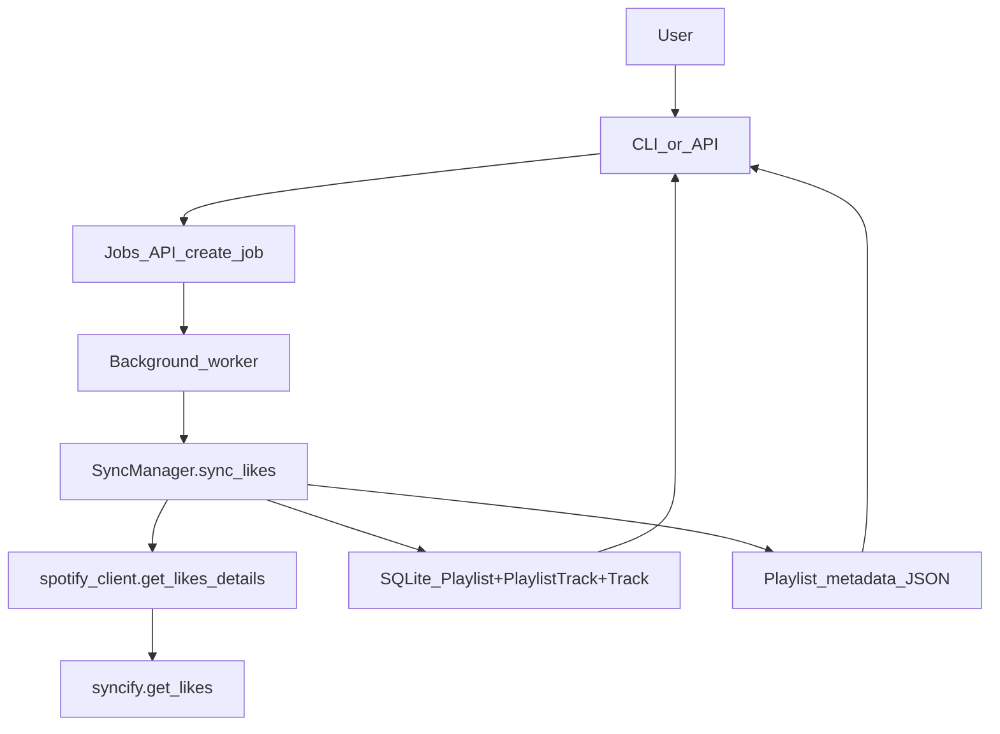

### Goal

Add a **"Liked Songs" pseudo-playlist** backed by `syncify-py>=2.1.0`'s login-based likes scraping, exposed in synciflow as a normal playlist with a **stable `playlist_id` of `"likes"`**. Users should be able to:

- Trigger a likes load/sync (which opens a browser for login via syncify).
- See `likes` listed alongside other playlists.
- Use `likes` anywhere a `playlist_id` is accepted (view tracks, export ZIP, etc.).
- Re-run likes sync later to update the local library.

### High-level design

- Represent **Liked Songs** as a regular row in the `Playlist` table and associated `PlaylistTrack` rows, with:
  - `playlist_id = "likes"` (constant, never changes).
  - A human-friendly `title` such as "Liked Songs".
  - Playlist metadata JSON under `storage_data/playlists/likes.json`.
- Use `syncify.get_likes(...)` as the upstream data source, wrapped by a new adapter in `spotify_client` that returns a `PlaylistDetails`-compatible structure.
- Add new **manager methods**, **job runners**, **API endpoints**, and **CLI commands** dedicated to likes, reusing the existing playlist/sync/job infrastructure as much as possible.
- Ensure that if the `likes` playlist has never been loaded, it behaves gracefully:
  - Listing playlists simply omits it until first created, or
  - Commands that specifically target `playlist_id="likes"` create an empty playlist row if needed.

### A. Core constants and schemas

1. **Introduce a shared constant for the likes ID**
  - Add `LIKES_PLAYLIST_ID = "likes"` to a core module used by managers (for example `[src/synciflow/core/utils.py](src/synciflow/core/utils.py)` or a new `[src/synciflow/core/constants.py](src/synciflow/core/constants.py)`).
  - Use this constant everywhere instead of hardcoding `"likes"`.
2. **Confirm schemas need no changes**
  - `Playlist.playlist_id` is already a free `str` primary key in `[src/synciflow/db/models.py](src/synciflow/db/models.py)`; no migration is needed for `"likes"`.
  - `PlaylistTrack` and playlist metadata JSON in `[src/synciflow/storage/playlist_metadata.py](src/synciflow/storage/playlist_metadata.py)` work unchanged with a `playlist_id` of `"likes"`.

### B. Spotify likes adapter (syncify integration)

1. **Extend `spotify_client` with likes support**
  - In `[src/synciflow/services/spotify_client.py](src/synciflow/services/spotify_client.py)`:
    - Add a new function, e.g. `get_likes_details(...)`, that wraps `syncify.get_likes` from `syncify-py>=2.1.0`.
    - Parameters: mirror syncify's `get_likes` (e.g. `login_timeout`, `page_load_timeout`, `scroll_pause`) with sensible defaults.
    - Return type: construct and return a `PlaylistDetails` from `[src/synciflow/schemas/playlist.py](src/synciflow/schemas/playlist.py)`:
      - `playlist_id = LIKES_PLAYLIST_ID`.
      - `playlist_url` can be a synthetic value (e.g. `"likes://user-liked-songs"`) or empty.
      - `title = "Liked Songs"` (override-able later if needed).
      - `playlist_image_url` empty or a placeholder.
      - `track_urls = list(details.track_urls)` from syncify.
2. **Error handling for login/selenium issues**
  - Wrap `get_likes` calls in try/except:
    - Convert Selenium/timeout/login failures into clear `RuntimeError`/`ValueError` with human-readable messages (e.g. "Login window closed before likes finished loading.").
    - Keep stack traces out of user-facing messages while allowing logs to capture full details if you log exceptions.
3. **Dependencies**
  - Ensure runtime dependency pins (e.g. `pyproject.toml` / `requirements.txt`) align with `requirements-dev.txt`'s `syncify-py>=2.1.0`, so likes support is available outside dev.

### C. PlaylistManager: loading likes as a playlist

1. **Refactor playlist loading to share core logic**
  - In `[src/synciflow/core/playlist_manager.py](src/synciflow/core/playlist_manager.py)`, extract common logic from `load_playlist` into a helper method, e.g. `_load_from_details(details: PlaylistDetails, playlist_id: str, progress_callback)` that:
    - Looks up or creates a `Playlist` row with the given `playlist_id`.
    - Updates `playlist_url`, `title`, `playlist_image_url` from `details`.
    - Clears existing `PlaylistTrack` rows for that `playlist_id`.
    - Iterates over `details.track_urls`, calling `TrackManager.load_track` and inserting `PlaylistTrack(playlist_id, track_id, position)`.
    - Writes `PlaylistMetadata` JSON with `playlist_id`, `title`, and `track_ids`.
  - Keep `load_playlist(url, ...)` as a thin wrapper that calls `spotify_client.get_playlist_details(url)`, derives `playlist_id` (from details or URL), and then calls `_load_from_details`.
2. **Add `load_likes` using the new helper**
  - Implement `PlaylistManager.load_likes(...)` that:
    - Calls `spotify_client.get_likes_details(...)`.
    - Sets `playlist_id = LIKES_PLAYLIST_ID`.
    - Calls `_load_from_details(details, LIKES_PLAYLIST_ID, progress_callback)`.
  - Behavior:
    - If a `Playlist` row for `LIKES_PLAYLIST_ID` doesn't exist, create it.
    - If it exists, update metadata and completely rebuild `PlaylistTrack` rows and playlist metadata JSON.
    - On exception from the adapter, propagate up so API/CLI job handling can mark the job as failed.
3. **Local-only behavior for `likes`**
  - `load_local(playlist_id)` already creates a bare `Playlist` row if missing and then tries to read playlist metadata JSON.
  - Confirm that calling `load_local(LIKES_PLAYLIST_ID)` when the likes playlist has not been scraped yet:
    - Creates a `Playlist` row with `playlist_id='likes'`, empty title/url.
    - Returns a playlist with no tracks (no metadata JSON present).
  - This satisfies the requirement: "if it's not loaded return empty and create it in playlists" for callers that address `playlist_id='likes'` directly.

### D. SyncManager: syncing likes over time

1. **Add a `sync_likes` entrypoint**
  - In `[src/synciflow/core/sync_manager.py](src/synciflow/core/sync_manager.py)`:
    - Factor out core sync logic from `sync_playlist` into a helper `_sync_from_details(details: PlaylistDetails, playlist_id: str, progress_callback) -> SyncResult` that:
      - Ensures a `Playlist` row exists/updated as in `sync_playlist`.
      - Computes `desired_track_urls` and derived `desired_track_ids`.
      - Calculates `to_add`, `to_remove`, and `kept` sets.
      - Rebuilds `PlaylistTrack` rows by calling `TrackManager.load_track(url)` for desired tracks.
      - Deletes unreferenced `Track` records and their files.
      - Updates `playlist.last_synced_at` and returns `SyncResult`.
    - Keep `sync_playlist(spotify_playlist_url, ...)` as a thin wrapper that obtains `details` via `get_playlist_details` and delegates to `_sync_from_details`.
2. **Implement `sync_likes` using likes adapter**
  - Implement `SyncManager.sync_likes(progress_callback=None) -> SyncResult` that:
    - Calls `spotify_client.get_likes_details(...)`.
    - Uses `playlist_id = LIKES_PLAYLIST_ID`.
    - Delegates to `_sync_from_details(details, LIKES_PLAYLIST_ID, progress_callback)`.
  - This makes the likes playlist fully participate in the **unique sync** behavior (add new liked tracks, remove tracks that are no longer liked, and clean up unreferenced audio files just like a regular synced playlist).

### E. Jobs, notification bus, and API endpoints

1. **Job runners for likes**
  - In `[src/synciflow/api/server.py](src/synciflow/api/server.py)`, add two new background-worker helpers:
    - `_run_likes_load_job(library: Library, job_id: str, bus: NotificationBus)`
      - Mirrors `_run_playlist_load_job` but calls `PlaylistManager.load_likes` with a `progress_callback`.
      - Publishes `PLAYLIST_PROGRESS` events and a `PLAYLIST_COMPLETED` event carrying `payload={"playlist_id": LIKES_PLAYLIST_ID}`.
      - On failure, calls `fail_job` and publishes `ERROR`.
    - `_run_likes_sync_job(library: Library, job_id: str, bus: NotificationBus)`
      - Mirrors `_run_sync_job` but calls `SyncManager.sync_likes` and publishes `SYNC_PROGRESS` / `SYNC_COMPLETED` events.
2. **API endpoints for likes**
  - Still in `create_app` of `[src/synciflow/api/server.py](src/synciflow/api/server.py)`:
    - Add `POST /likes/load` that:
      - Creates a job via `create_job(session, "likes_load")`.
      - Schedules `asyncio.to_thread(_run_likes_load_job, library, job.job_id, bus)`.
      - Returns `{ "job_id": job.job_id }` with 202.
    - Add `POST /likes/sync` that:
      - Creates a job via `create_job(session, "likes_sync")`.
      - Schedules `_run_likes_sync_job` similarly.
      - Returns `{ "job_id": job.job_id }` with 202.
  - Because the playlist row for `LIKES_PLAYLIST_ID` is just a normal `Playlist`, **all existing playlist read/export endpoints** (`/playlists`, `/playlist/{playlist_id}`, `/playlist/{playlist_id}/tracks`, `/playlist/{playlist_id}/download.zip`) will work for `playlist_id="likes"` once it has been loaded or locally registered.
3. **Job type conventions and notifications**
  - Keep job types descriptive (`"likes_load"`, `"likes_sync"`) to distinguish from `"playlist_load"` and `"sync"` in `[src/synciflow/core/job_manager.py](src/synciflow/core/job_manager.py)` and any consumers of `/jobs/{job_id}`.
  - Ensure notification payloads (e.g. `PLAYLIST_COMPLETED`, `SYNC_COMPLETED`) include `playlist_id="likes"` so frontends can easily identify likes jobs.

### F. CLI (basic) integration

1. **Add a `likes` command to the basic CLI**
  - In `[src/synciflow/cli/main.py](src/synciflow/cli/main.py)`:
    - Introduce a new command, e.g. `synciflow likes`, with a docstring like "Load or sync your Spotify Liked Songs into the offline library as a playlist with ID 'likes'.".
    - Implementation options:
      - **Option A (simple)**: call `PlaylistManager.load_likes` once, downloading all liked tracks and (re)building the playlist.
      - **Option B (sync semantics)**: call `SyncManager.sync_likes` so reruns behave exactly like `synciflow sync` (add new likes, remove unliked tracks).
    - Show a progress bar similar to `playlist` and `sync` commands, plus a final summary including `playlist_id` and `SyncResult` stats if using sync semantics.
2. **Re-use existing playlist commands for post-load operations**
  - Document that once the likes playlist has been created, all existing commands that take `playlist_id` work normally with `likes`, e.g.:
    - `synciflow playlist-local likes`
    - `synciflow download-playlist-zip likes /path/to/output`
    - `synciflow save-playlist likes /path/to/output`
  - No code change is required for these commands; they will just see `playlist_id='likes'` as a normal playlist.

### G. Smart CLI integration

1. **Add menu actions for likes**
  - In `[src/synciflow/cli/smart.py](src/synciflow/cli/smart.py)`:
    - Extend the main menu to include an action such as "Sync Liked Songs (playlist id: likes)".
    - Implement a helper function `_sync_likes(lib: Library)` that:
      - Uses `SyncManager.sync_likes` (or `PlaylistManager.load_likes`) with a `rich` progress UI.
      - On success, prints a panel showing `playlist_id='likes'`, title, and sync stats.
  - Optionally, add a shortcut in the playlist details menu: if the user enters `likes` as the playlist ID, treat it normally but maybe label it as the special Liked Songs playlist in prompts.
2. **Handle initial empty state**
  - If `LIKES_PLAYLIST_ID` is not yet present in the DB when entering a `likes`-based menu flow:
    - Either:
      - Offer to create and sync it immediately, or
      - Create an empty `Playlist` via `load_local('likes')` and show that it has 0 tracks with a hint about running the likes sync action.
  - This keeps behavior consistent with the requirement that `likes` is a known, static ID even before it has data.

### H. Documentation updates (README and usage)

1. **Requirements note**
  - In `[README.md](README.md)`, clarify the dependency on `syncify-py>=2.1.0` for Liked Songs support, referencing the already-updated `[requirements-dev.txt](requirements-dev.txt)` and any runtime dependency declarations.
2. **Feature list and How It Works**
  - Under the features section, add a bullet describing Liked Songs support:
    - E.g. "Scrape Spotify Liked Songs via syncify, exposing them as a playlist with ID `likes` in the local library."
  - In the "How It Works" section, add a short sub-section about the Liked Songs flow:
    - Input is a **login-based likes scrape** instead of a playlist URL.
    - A browser window opens for the user to log in.
    - Once loaded, likes appear as a pseudo-playlist in the DB.
3. **CLI usage examples**
  - Document new commands in the CLI section, e.g.:
    - `synciflow likes` (or whatever naming is chosen) with example output.
    - Show how to export or inspect likes via existing playlist commands by using `playlist_id=likes`.
4. **API reference updates**
  - Extend the API reference table to include:
    - `POST /likes/load` and `POST /likes/sync` with descriptions and example responses.
  - Mention that the `likes` playlist can be queried via existing `/playlist/{playlist_id}` and `/playlist/{playlist_id}/tracks` endpoints with `playlist_id=likes`.

### I. Error handling and UX considerations

1. **Login & browser behavior**
  - Clearly document in `README.md` and CLI help strings that likes operations:
    - Will open a visible Chrome window for Spotify login.
    - May timeout if login or rendering takes too long; refer to `login_timeout` and related parameters.
  - Make CLI error messages explicit when login fails or the window is closed early.
2. **Non-loaded likes behavior**
  - Ensure that if likes have never been successfully loaded via syncify:
    - `synciflow playlists` will simply not list `likes` until it exists in the DB, **or** you intentionally create an empty `Playlist` row as part of the first likes-related action.
    - API calls to `/playlist/likes` return 404 until the playlist exists (unless you choose to auto-create on access via `load_local`).
  - Decide and implement a consistent policy (likely: auto-create on any explicit `likes`-targeting action; do not auto-create on generic listing).
3. **Resilience & retries**
  - Reuse the existing `_commit_with_retry` flow in `[src/synciflow/core/job_manager.py](src/synciflow/core/job_manager.py)` indirectly via job helpers, ensuring likes jobs behave consistently with playlist jobs under transient SQLite lock errors.

### J. High-level data flow (for likes)

This diagram shows that **likes sync** follows the same pattern as playlist sync: a background job calls into `SyncManager`, which uses `spotify_client` and `syncify` to get the canonical set of liked track URLs, then updates the DB and playlist metadata accordingly.