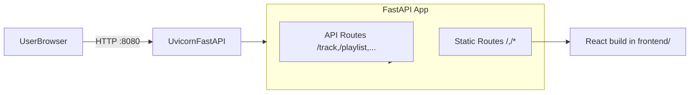

## Goal

Integrate the existing `frontend` production build into the Python package so that:

- **Build time**: the `frontend` dist folder is included in the wheel/sdist.
- **Runtime**: the `synciflow serve` command serves **both** the FastAPI backend and the static React UI from a single process, on a configurable port (default 8080), suitable for production use.

## High-level design

- **Package layout**: Treat `frontend/` as a built static asset directory that should be shipped inside the installed package.
- **Static file serving**:
  - Mount the React build as static files under the same FastAPI app used for the API.
  - Serve `/` and any unknown non-API routes with `index.html` to support client-side routing.
  - Keep API endpoints under their existing paths; optionally treat anything prefixed with `/api` as API-only and everything else as frontend.
- **Configurable port**:
  - Default the CLI `serve` command to port **8080** instead of 8000.
  - Expose a simple way (CLI option or environment variable) to override this port later.

## Detailed steps

### 1. Package the `frontend` dist with the project

- **Update `pyproject.toml`**:
  - Under `[tool.hatch.build.targets.sdist]` `include`, add the `frontend` directory so it is present in source distributions.
  - Under `[tool.hatch.build.targets.wheel]`, configure package data so that the `frontend` directory inside `src/synciflow` (or at repo root, depending on your final location) is bundled into the wheel.
- **Decide final install path** (recommended):
  - Move or copy the built frontend dist into `src/synciflow/frontend` as part of your build/release process (outside of Python packaging itself).
  - This makes it easy for the code to locate assets using `importlib.resources.files("synciflow") / "frontend"`.
- **Plan for rebuilds** (manual / CI):
  - Document that before building a release (`python -m build` or `hatch build`), the React project must be built (e.g. `npm run build`), outputting into the `frontend` directory that will be packaged.

### 2. Wire frontend static serving into the FastAPI app

- **Determine frontend root directory at runtime**:
  - In `src/synciflow/api/server.py`, compute a `frontend_dir` using either:
    - `importlib.resources` to locate `synciflow/frontend`, or
    - A fallback to a filesystem path (e.g. project root) when running from source.
- **Mount static files**:
  - Use `fastapi.staticfiles.StaticFiles` to mount the `frontend/assets` and other static files under the app.
  - Add a catch-all route that returns `index.html` for `"/"` and any path that does not start with the API prefix.
- **Preserve API behavior**:
  - Ensure all existing API routes continue to work unchanged.
  - Optionally group API endpoints under `/api` in the future; for now, treat exact matches to existing paths as API, and let everything else fall back to the frontend.

### 3. Update the CLI `serve` command to run combined app on port 8080

- **Change default port**:
  - In `src/synciflow/cli/main.py`, update the `serve` command signature so the default `port` is 8080 instead of 8000.
- **Expose configuration hook**:
  - Keep `host` and `port` CLI options so they can be overridden when calling `synciflow serve`.
  - Optionally, later you can add an environment-variable override (e.g. `SYNCIFLOW_PORT`) if desired.
- **Run the same FastAPI app**:
  - Reuse `create_app` from `synciflow.api.server`, which will now include both API and static frontend mounting.
  - Confirm that `uvicorn.run(api, host=host, port=port)` serves both API and UI together.

### 4. Production suitability considerations

- **Static file efficiency**:
  - Use `StaticFiles` with `html=True` and ensure `index.html` is efficiently served.
  - Confirm cache headers are appropriate (can be improved later if needed).
- **Error handling**:
  - If the frontend directory is missing (e.g. developer forgot to build or install from wheel without assets), return a clear JSON error for `/` and log a warning, rather than crashing the entire server.
- **Documentation**:
  - Add a short section to `README.md` describing:
    - How to build the frontend.
    - How to build and install the Python package so the UI is included.
    - How to run `synciflow serve` and access the UI on `http://localhost:8080`.

## Todos

- **packaging-frontend**: Configure `pyproject.toml` so the `frontend` dist directory is included in sdist and wheel builds (using hatch build configuration) and decide on the final location under the `synciflow` package.
- **static-serving**: Extend `create_app` in `src/synciflow/api/server.py` to serve the React build (static files and `index.html`) alongside existing API routes.
- **cli-serve-port**: Update `serve` in `src/synciflow/cli/main.py` to default to port 8080 and confirm it runs the combined app.
- **docs-update**: Update `README.md` with instructions for building the frontend, packaging, and serving the combined UI/API on port 8080.

